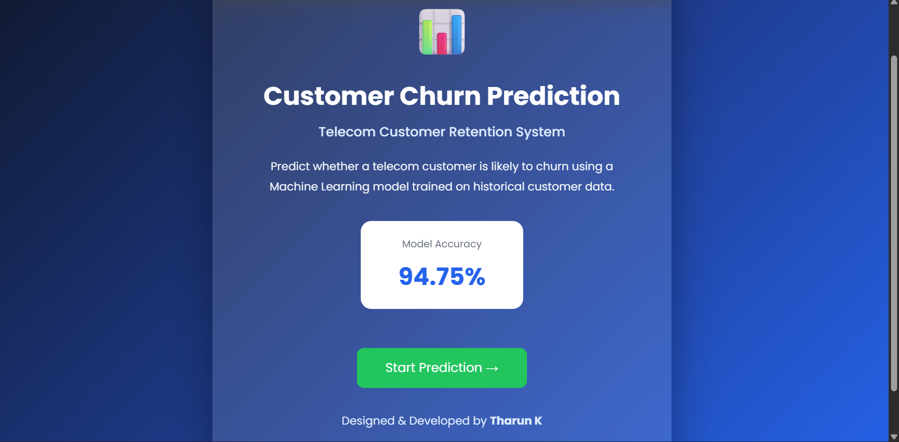
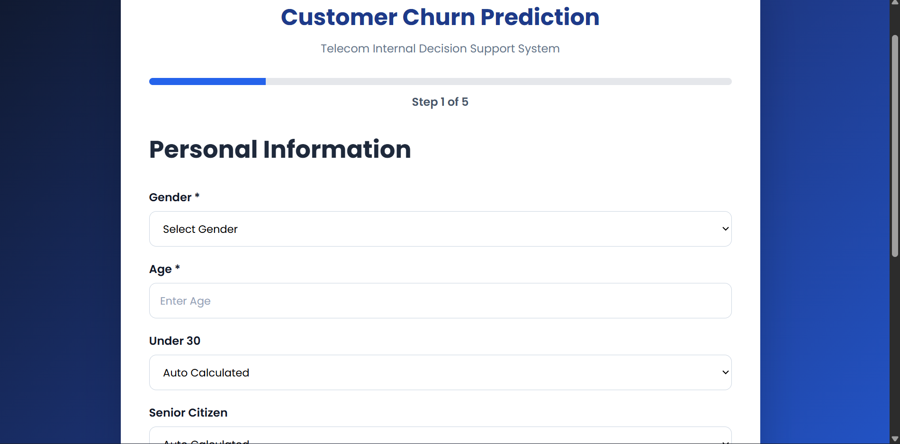
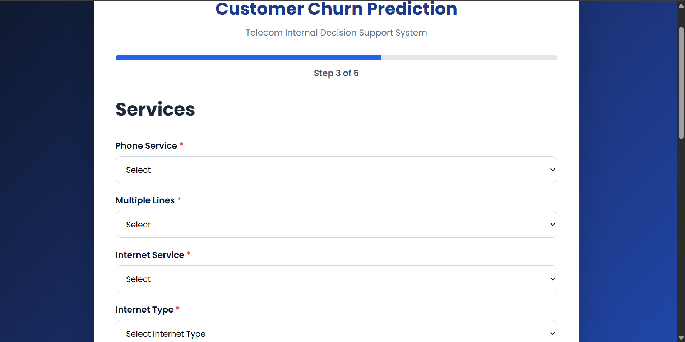
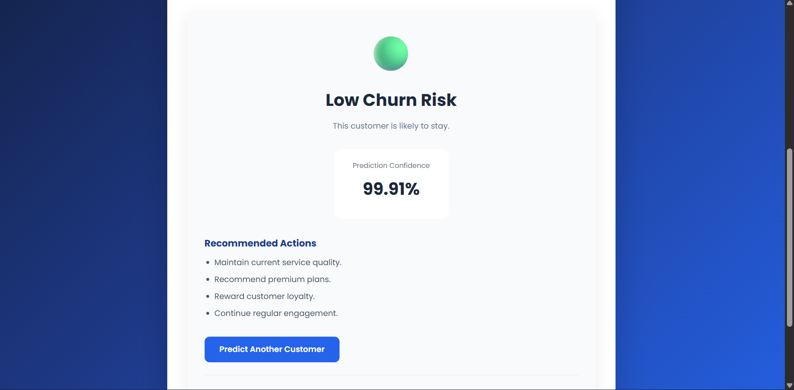
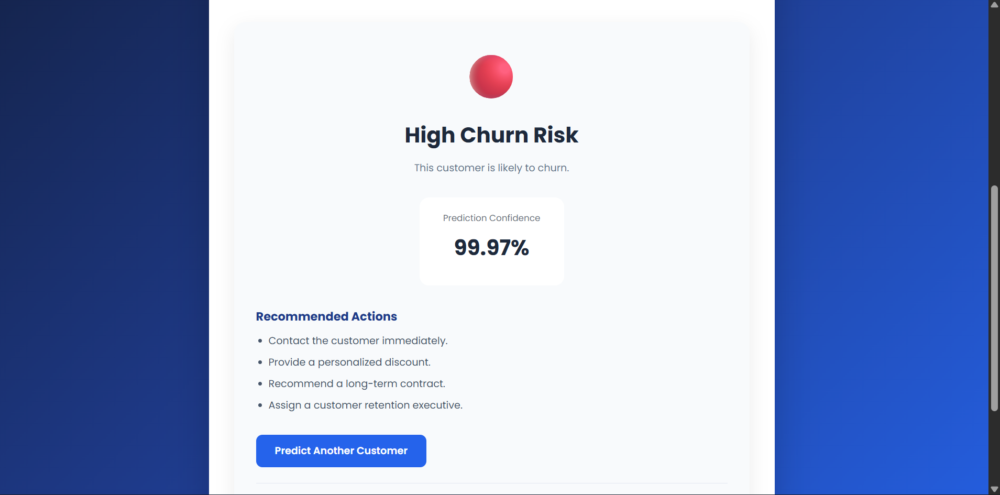

# 📊 Customer Churn Prediction System

A Machine Learning-powered web application that predicts whether a telecom customer is likely to churn based on customer information.

The project uses a trained ML model with **94.75% accuracy** and provides an interactive multi-step prediction interface built using Flask.

---

## 🚀 Features

- Multi-step customer information form
- Predict customer churn instantly
- Prediction confidence score
- High Churn / Low Churn visualization
- Customer retention recommendations
- Responsive modern UI
- Flask web application
- Machine Learning Pipeline

---

## 🛠 Tech Stack

- Python
- Flask
- Scikit-learn
- Pandas
- NumPy
- HTML
- CSS
- JavaScript

---

## 🤖 Machine Learning Model

- Algorithm: Random Forest Classifier
- Accuracy: **94.75%**
- Dataset: Telecom Customer Churn Dataset
- Preprocessing Pipeline Included
- Probability Prediction Supported

---

# 📸 Screenshots

## 🏠 Landing Page



---

## 👤 Personal Information



---

## 🌐 Service Details



---

## 🟢 Low Churn Prediction



---

## 🔴 High Churn Prediction



---

## ⚙ Installation

Clone the repository

```bash
git clone https://github.com/tharsna1208/customer-churn-prediction-pro.git
```

Install dependencies

```bash
pip install -r requirements.txt
```

Run the project

```bash
python app.py
```

Open

```
http://127.0.0.1:5000
```

---

## 📈 Future Improvements

- Deploy using Railway
- User Authentication
- Database Integration
- Explainable AI (SHAP)
- Customer Analytics Dashboard
- CSV Bulk Prediction

---

## 👨‍💻 Developer

**Tarun K**

AI & Machine Learning Engineer

GitHub:
https://github.com/tharsna1208

LinkedIn:
https://www.linkedin.com/in/tharunk20408
